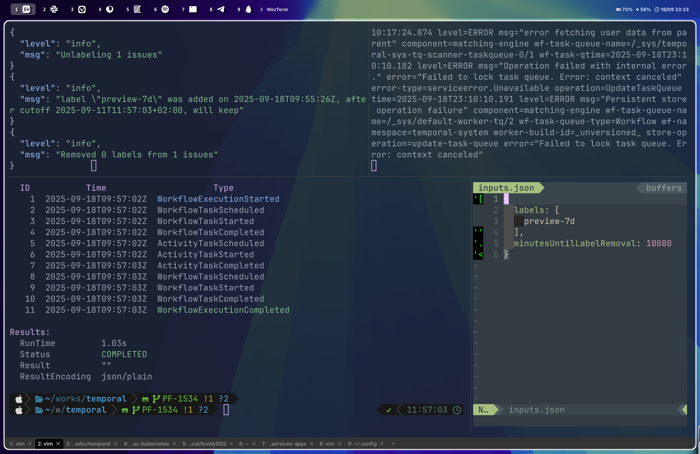

# Prerequisites

Hide the default macOS menu bar in System Settings -> Control Center -> Automatically hide and show the menu bar -> Always.

## Homebrew Fonts Installation Script

```
brew install --cask font-sf-pro
brew install --cask font-sketchybar-app-font
brew install --cask font-hack-nerd-font
```
## Installation

Copy these files to `~/.config/` and run `my-bash-scripts/initial-ln-commands.sh` to create the necessary symlinks.

## Screenshot



## Some of the openSource software that I am using daily

* https://github.com/vim/vim
* https://github.com/wezterm/wezterm
* https://github.com/ggreer/the_silver_searcher
* https://github.com/catppuccin/zed
* https://github.com/atuinsh/atuin
* https://github.com/nikitabobko/AeroSpace
* https://github.com/FelixKratz/SketchyBar
* https://github.com/FelixKratz/JankyBorders
* https://github.com/chipsenkbeil/choose
* https://github.com/dandavison/delta
* https://github.com/sainnhe/everforest
* https://github.com/jesseduffield/lazygit
* https://github.com/astral-sh/uv
* https://github.com/sharkdp/bat

## Fun commands

To see your most used commands with atuin and bash history:

```bash
atuin history list  | awk '{print $3}' | sort | uniq -c | sort -nr | head -n 30
history | awk -F'[[:space:]]+' '{print $3}' | sort | uniq -c | sort -nr | head -n 30
```
